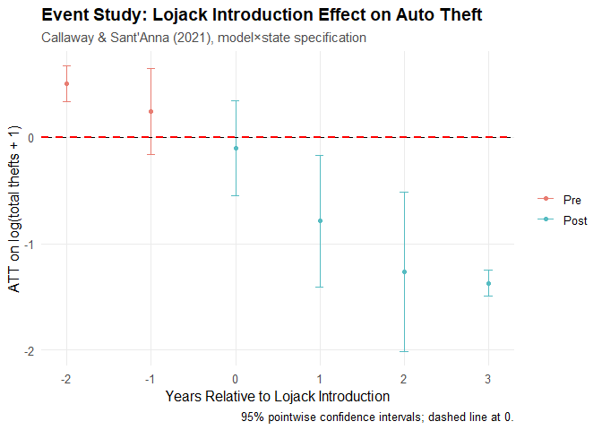
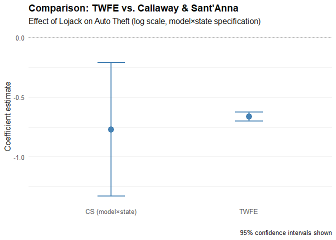

# DataPreparation
Manuel Zerobin

- [Project](#project)
- [Task](#task)
- [Load relevant functions and
  packages](#load-relevant-functions-and-packages)
- [Load data](#load-data)
- [Estimation](#estimation)
- [CS estimation:](#cs-estimation)
  - [Closest to original
    specification](#closest-to-original-specification)
  - [Next closest specificaiont](#next-closest-specificaiont)

# Project

- Replication of: Gonzalez-Navarro, Marco. 2013. “Deterrence and
  Geographical Externalities in Auto Theft.” American Economic Journal:
  Applied Economics 5 (4): 92–110

# Task

- Load data and run replication of provided Stata code in R. After
  running the replication, an attempt is made to implement the Callaway
  St’Anna estimator.

# Load relevant functions and packages

<details class="code-fold">
<summary>Code</summary>

``` r
library(here) # load here package for relative paths

source(here('R-Scripts', 'Functions.R')) # source relevant functions

package_verification(packages = c('tidyverse', 
                                  'lubridate',
                                  'arrow',
                                  'data.table',
                                  'dtplyr',
                                  'haven',
                                  'fixest',
                                  'MASS',
                                  'modelsummary',
                                  'knitr',
                                  'kableExtra',
                                  'ggplot2',
                                  'did',
                                  'dplyr'), 
                     type = 'script')
```

</details>

Set seed, just in case

<details class="code-fold">
<summary>Code</summary>

``` r
set.seed(123456789)
```

</details>

# Load data

<details class="code-fold">
<summary>Code</summary>

``` r
data = read_dta(here('Supplementary-Files/Replication-Package/Replication_files/data/thefts_sales.dta'))
```

</details>
<details class="code-fold">
<summary>Code</summary>

``` r
# Create descriptive statistics table
desc.stats = data %>%
  dplyr::select(sales, thefts, LJmodel, LJstate, LJ, age) %>%
  summarise(
    across(everything(), list(
      mean = ~ mean(.x, na.rm = TRUE),
      sd = ~ sd(.x, na.rm = TRUE),
      min = ~ min(.x, na.rm = TRUE),
      max = ~ max(.x, na.rm = TRUE)
    ))
  ) %>%
  pivot_longer(everything(), names_to = "variable", values_to = "value") %>%
  separate(variable, into = c("variable", "statistic"), sep = "_") %>%
  pivot_wider(names_from = statistic, values_from = value) %>%
  mutate(
    Variable = case_when(
      variable == "sales" ~ "Vintage size",
      variable == "thefts" ~ "Annual thefts",
      variable == "LJmodel" ~ "Lojack model = 1",
      variable == "LJstate" ~ "Lojack state = 1",
      variable == "LJ" ~ "Lojack",
      variable == "age" ~ "Age of vehicle"
    ),
    Mean = round(mean, 3),
    SD = round(sd, 2),
    Min = as.integer(min),
    Max = ifelse(max >= 1000, format(max, big.mark = ",", scientific = FALSE), as.character(as.integer(max)))
  )

# Now select the final columns
desc.stats = desc.stats %>%
  dplyr::select(Variable, Mean, SD, Min, Max)

# Display table
kable(desc.stats, caption = "TABLE 1—DESCRIPTIVE STATISTICS")
```

</details>

<table>
<caption>TABLE 1—DESCRIPTIVE STATISTICS</caption>
<thead>
<tr class="header">
<th style="text-align: left;">Variable</th>
<th style="text-align: right;">Mean</th>
<th style="text-align: right;">SD</th>
<th style="text-align: right;">Min</th>
<th style="text-align: left;">Max</th>
</tr>
</thead>
<tbody>
<tr class="odd">
<td style="text-align: left;">Vintage size</td>
<td style="text-align: right;">609.694</td>
<td style="text-align: right;">1752.92</td>
<td style="text-align: right;">1</td>
<td style="text-align: left;">32,940</td>
</tr>
<tr class="even">
<td style="text-align: left;">Annual thefts</td>
<td style="text-align: right;">4.377</td>
<td style="text-align: right;">30.87</td>
<td style="text-align: right;">0</td>
<td style="text-align: left;">1,502</td>
</tr>
<tr class="odd">
<td style="text-align: left;">Lojack model = 1</td>
<td style="text-align: right;">0.158</td>
<td style="text-align: right;">0.36</td>
<td style="text-align: right;">0</td>
<td style="text-align: left;">1</td>
</tr>
<tr class="even">
<td style="text-align: left;">Lojack state = 1</td>
<td style="text-align: right;">0.179</td>
<td style="text-align: right;">0.38</td>
<td style="text-align: right;">0</td>
<td style="text-align: left;">1</td>
</tr>
<tr class="odd">
<td style="text-align: left;">Lojack</td>
<td style="text-align: right;">0.006</td>
<td style="text-align: right;">0.08</td>
<td style="text-align: right;">0</td>
<td style="text-align: left;">1</td>
</tr>
<tr class="even">
<td style="text-align: left;">Age of vehicle</td>
<td style="text-align: right;">0.811</td>
<td style="text-align: right;">0.93</td>
<td style="text-align: right;">0</td>
<td style="text-align: left;">3</td>
</tr>
</tbody>
</table>

TABLE 1—DESCRIPTIVE STATISTICS

**Notes:** N = 16,764. An observation is defined by a (state, car model,
vintage, year of theft) combination. Vintage Size refers to total sales
in a (state, car model, vintage) triplet. Age of car is in terms of
completed years since sale (0 if the car is up to 12 months old, etc.).
Sold with Lojack equals one if the car model was equipped with Lojack
when the vehicle was sold. Lojack Models refers to the Ford vehicle
models that participated in the Lojack program at some point between
1999 and 2004. Lojack states are the four states where Lojack was
implemented between 1999 and 2004.

**Surprise:** `Lojack model = 1` shows a value of `0.162` in the
original table. Let us investigate:

<details class="code-fold">
<summary>Code</summary>

``` r
# Isolate and describe the LJmodel discrepancy problem
# 1. Current data summary
current.ljmodel.table = table(data$LJmodel)
current.mean = mean(data$LJmodel, na.rm = TRUE)
current.n = nrow(data)

current.data.df <- data.frame(
  Value = c("0", "1", "Total", "Mean"),
  Count = c(
    if ("0" %in% names(current.ljmodel.table)) current.ljmodel.table["0"] else 0,
    if ("1" %in% names(current.ljmodel.table)) current.ljmodel.table["1"] else 0,
    current.n,
    ""
  ),
  Percentage = c(
    round(if ("0" %in% names(current.ljmodel.table)) current.ljmodel.table["0"] / current.n * 100 else 0, 2),
    round(if ("1" %in% names(current.ljmodel.table)) current.ljmodel.table["1"] / current.n * 100 else 0, 2),
    "",
    round(current.mean * 100, 2)
  )
)
print(knitr::kable(current.data.df, caption = "Current Data Summary"))
```

</details>


    Table: Current Data Summary

    |Value |Count |Percentage |
    |:-----|:-----|:----------|
    |0     |14113 |84.19      |
    |1     |2651  |15.81      |
    |Total |16764 |           |
    |Mean  |      |15.81      |

<details class="code-fold">
<summary>Code</summary>

``` r
# 2. Reference table expectations
reference.mean = 0.162
reference.n = 16764
expected.ljmodel.ones = reference.mean * reference.n

reference.df <- data.frame(
  Metric = c("Reference Mean", "Reference N", "Expected LJmodel=1 Observations"),
  Value = c(reference.mean, reference.n, round(expected.ljmodel.ones))
)
print(knitr::kable(reference.df, caption = "Reference Table Expectations"))
```

</details>


    Table: Reference Table Expectations

    |Metric                          |     Value|
    |:-------------------------------|---------:|
    |Reference Mean                  |     0.162|
    |Reference N                     | 16764.000|
    |Expected LJmodel=1 Observations |  2716.000|

<details class="code-fold">
<summary>Code</summary>

``` r
# 3. Quantify the discrepancy
actual.ljmodel.ones = sum(data$LJmodel == 1)
missing.observations = expected.ljmodel.ones - actual.ljmodel.ones
mean.difference = reference.mean - current.mean

discrepancy.df <- data.frame(
  Metric = c("Actual LJmodel=1 Observations", "Missing LJmodel=1 Observations", "Mean Difference", "Percentage Difference (%)"),
  Value = c(
    actual.ljmodel.ones,
    round(missing.observations),
    round(mean.difference, 6),
    round((mean.difference / reference.mean) * 100, 2)
  )
)
print(knitr::kable(discrepancy.df, caption = "Discrepancy Quantification"))
```

</details>


    Table: Discrepancy Quantification

    |Metric                         |     Value|
    |:------------------------------|---------:|
    |Actual LJmodel=1 Observations  | 2.651e+03|
    |Missing LJmodel=1 Observations | 6.500e+01|
    |Mean Difference                | 3.864e-03|
    |Percentage Difference (%)      | 2.380e+00|

<details class="code-fold">
<summary>Code</summary>

``` r
# 4. Verify consistency
calculated.difference = mean.difference * current.n
consistency.df <- data.frame(
  Metric = c("Calculated Missing Obs from Mean Diff", "Direct Count Difference", "Match"),
  Value = c(
    round(calculated.difference),
    round(missing.observations),
    round(calculated.difference) == round(missing.observations)
  )
)
print(knitr::kable(consistency.df, caption = "Consistency Check"))
```

</details>


    Table: Consistency Check

    |Metric                                | Value|
    |:-------------------------------------|-----:|
    |Calculated Missing Obs from Mean Diff |    65|
    |Direct Count Difference               |    65|
    |Match                                 |     1|

# Estimation

<details class="code-fold">
<summary>Code</summary>

``` r
# Table 2 - Column 1: 
# local x_ = "i.age id__*"
# nbreg thefts `x_' LJ NLJM_LJS_After NLJS_LJM_After NLJS_NLJM_After, exposure(sales) cluster(state_code) technique(bfgs)
model.t2.c1 = fenegbin(
  thefts ~ LJ + NLJM_LJS_After + NLJS_LJM_After + NLJS_NLJM_After + i(age) | id,
  data = data,
  offset = ~log(sales),
  vcov = ~state_code
)
```

</details>

    NOTE: 170 fixed-effects (1,757 observations) removed because of only 0 outcomes or singletons.

<details class="code-fold">
<summary>Code</summary>

``` r
# Table 2 - Column 2: 
timetrendstate.vars = grep("^timetrendstate_", names(data), value = TRUE)
formula.str = paste("thefts ~ LJ + NLJM_LJS_After + NLJS_LJM_After + NLJS_NLJM_After + i(age) +", 
                     paste(timetrendstate.vars, collapse = " + "), "| id")
model.t2.c2 = fenegbin(
  as.formula(formula.str),
  data = data,
  offset = ~log(sales),
  vcov = ~state_code
)
```

</details>

    NOTE: 170 fixed-effects (1,757 observations) removed because of only 0 outcomes or singletons.

    Warning: The VCOV matrix is not positive semi-definite and was 'fixed' (see
    ?vcov).

<details class="code-fold">
<summary>Code</summary>

``` r
# Table 2 - Column 3:
timetrendstate.vars = grep("^timetrendstate_", names(data), value = TRUE)
timetrendstate2.vars = grep("^timetrendstate2_", names(data), value = TRUE)
formula.str = paste("thefts ~ LJ + NLJM_LJS_After + NLJS_LJM_After + NLJS_NLJM_After + i(age) +", 
                     paste(c(timetrendstate.vars, timetrendstate2.vars), collapse = " + "), "| id")
model.t2.c3 = fenegbin(
  as.formula(formula.str),
  data = data,
  offset = ~log(sales),
  vcov = ~state_code
)
```

</details>

    NOTE: 170 fixed-effects (1,757 observations) removed because of only 0 outcomes or singletons.

    Warning: The VCOV matrix is not positive semi-definite and was 'fixed' (see
    ?vcov).

<details class="code-fold">
<summary>Code</summary>

``` r
# Table 2 - Column 4: 
timetrendstate.vars = grep("^timetrendstate_", names(data), value = TRUE)
timetrendstate2.vars = grep("^timetrendstate2_", names(data), value = TRUE)
formula.str = paste("thefts ~ LJ + NLJM_LJS_After + NLJS_LJM_After + NLJS_NLJM_After +", 
                     paste(c(timetrendstate.vars, timetrendstate2.vars), collapse = " + "), "| id")
model.t2.c4 = fenegbin(
  as.formula(formula.str),
  data = data[data$age == 1, ],
  offset = ~log(sales),
  vcov = ~state_code
)
```

</details>

    NOTE: 443 fixed-effects (1,474 observations) removed because of only 0 outcomes or singletons.

    Warning: The VCOV matrix is not positive semi-definite and was 'fixed' (see
    ?vcov).

<details class="code-fold">
<summary>Code</summary>

``` r
# Table 2 - Column 5:
timetrendstate.vars = grep("^timetrendstate_", names(data), value = TRUE)
timetrendstate2.vars = grep("^timetrendstate2_", names(data), value = TRUE)
nljs.ljm.after.dcat.vars = grep("^NLJS_LJM_After_dcat_", names(data), value = TRUE)
nljs.nljm.after.dcat.vars = grep("^NLJS_NLJM_After_dcat_", names(data), value = TRUE)
formula.str = paste("thefts ~ LJ + NLJM_LJS_After +", 
                     paste(c(nljs.ljm.after.dcat.vars, nljs.nljm.after.dcat.vars, timetrendstate.vars, timetrendstate2.vars), collapse = " + "), "| id")
model.t2.c5 = fenegbin(
  as.formula(formula.str),
  data = data[data$age == 1, ],
  offset = ~log(sales),
  vcov = ~state_code
)
```

</details>

    NOTE: 443 fixed-effects (1,474 observations) removed because of only 0 outcomes or singletons.

    Warning: The VCOV matrix is not positive semi-definite and was 'fixed' (see
    ?vcov).

<details class="code-fold">
<summary>Code</summary>

``` r
# Table 2 - Column 6:
data$model.x.yr.stolen = data$model_group_code * 10000 + data$yr_stolen
model.t2.c6 = fenegbin(
  thefts ~ LJ + NLJM_LJS_After + NLJS_LJM_After_Close + NLJS_NLJM_After_Close + i(age) | id + model.x.yr.stolen,
  data = data,
  offset = ~log(sales),
  vcov = ~state_code
)
```

</details>

    NOTE: 171/29 fixed-effects (1,943 observations) removed because of only 0 outcomes or singletons.

<details class="code-fold">
<summary>Code</summary>

``` r
# Table 2 - Column 7:
timetrendstate.vars = grep("^timetrendstate_", names(data), value = TRUE)
timetrendstate2.vars = grep("^timetrendstate2_", names(data), value = TRUE)
formula.str = paste("thefts ~ LJage0 + LJage1 + LJage2 + NLJM_LJS_After + NLJS_LJM_After + NLJS_NLJM_After + i(age) +", 
                     paste(c(timetrendstate.vars, timetrendstate2.vars), collapse = " + "), "| id")
model.t2.c7 = fenegbin(
  as.formula(formula.str),
  data = data,
  offset = ~log(sales),
  vcov = ~state_code
)
```

</details>

    NOTE: 170 fixed-effects (1,757 observations) removed because of only 0 outcomes or singletons.

    Warning: The VCOV matrix is not positive semi-definite and was 'fixed' (see
    ?vcov).

<details class="code-fold">
<summary>Code</summary>

``` r
# Function to safely extract coefficient and standard error
safe_extract = function(model, var_name) {
  tryCatch({
    if (var_name %in% names(coef(model))) {
      coef_val = coef(model)[var_name]
      se_val = sqrt(diag(vcov(model)))[var_name]
      
      # Determine significance stars
      p_val = 2 * (1 - pnorm(abs(coef_val / se_val)))
      stars = ifelse(p_val < 0.001, "***",
                    ifelse(p_val < 0.01, "**",
                          ifelse(p_val < 0.05, "*", "")))
      
      # Format coefficient and standard error
      coef_formatted = sprintf("%.2f%s", coef_val, stars)
      se_formatted = sprintf("(%.3f)", se_val)
      
      return(list(coef = coef_formatted, se = se_formatted))
    } else {
      return(list(coef = "", se = ""))
    }
  }, error = function(e) {
    return(list(coef = "", se = ""))
  })
}

# Create table structure
create_table_row = function(var_name, models) {
  row_data = c(var_name)
  se_data = c("")
  
  for (model in models) {
    result = safe_extract(model, var_name)
    row_data = c(row_data, result$coef)
    se_data = c(se_data, result$se)
  }
  
  return(rbind(row_data, se_data))
}

# List of models
models = list(model.t2.c1, model.t2.c2, model.t2.c3, model.t2.c4, model.t2.c5, model.t2.c6, model.t2.c7)

# Create table rows
table_rows = list()

# LJ = 1
table_rows = rbind(table_rows, create_table_row("LJ", models))

# NLJM LJS after = 1
table_rows = rbind(table_rows, create_table_row("NLJM_LJS_After", models))

# LJM NLJS after = 1
table_rows = rbind(table_rows, create_table_row("NLJS_LJM_After", models))

# NLJM NLJS after = 1
table_rows = rbind(table_rows, create_table_row("NLJS_NLJM_After", models))

# LJ = 1, first year on road (LJage0)
lj_first_row = c("LJ = 1, first year on road", "", "", "", "", "", "", safe_extract(model.t2.c7, "LJage0")$coef)
lj_first_se = c("", "", "", "", "", "", "", safe_extract(model.t2.c7, "LJage0")$se)
table_rows = rbind(table_rows, lj_first_row, lj_first_se)

# LJ = 1, second year on road (LJage1) 
lj_second_row = c("LJ = 1, second year on road", "", "", "", "", "", "", safe_extract(model.t2.c7, "LJage1")$coef)
lj_second_se = c("", "", "", "", "", "", "", safe_extract(model.t2.c7, "LJage1")$se)
table_rows = rbind(table_rows, lj_second_row, lj_second_se)

# Distance percentile interactions (only for column 5)
dist_vars = c("NLJS_LJM_After_dcat_1", "NLJS_LJM_After_dcat_2", "NLJS_LJM_After_dcat_3",
              "NLJS_NLJM_After_dcat_1", "NLJS_NLJM_After_dcat_2", "NLJS_NLJM_After_dcat_3")
dist_labels = c("(LJM NLJS after = 1) × (dis. pct. < 33)",
                "(LJM NLJS after = 1) × (33 < dis. pct. < 66)",
                "(LJM NLJS after = 1) × (dis. pct. > 66)",
                "(NLJM NLJS after = 1) × (dis. pct. < 33)",
                "(NLJM NLJS after = 1) × (33 < dis. pct. < 66)",
                "(NLJM NLJS after = 1) × (dis. pct. > 66)")

for (i in 1:6) {
  dist_row = c(dist_labels[i], "", "", "", "", safe_extract(model.t2.c5, dist_vars[i])$coef, "", "")
  dist_se = c("", "", "", "", "", safe_extract(model.t2.c5, dist_vars[i])$se, "", "")
  table_rows = rbind(table_rows, dist_row, dist_se)
}

# Add summary statistics
summary_rows = rbind(
  c("", "", "", "", "", "", "", ""),
  c("Observations", "16,764", "16,764", "16,764", "5,185", "5,185", "16,764", "16,764"),
  c("Time controls", "None", "Linear", "Quadratic", "Quadratic", "Quadratic", "Model × year", "Quadratic"),
  c("State specific time controls", "No", "Yes", "Yes", "Yes", "Yes", "No", "Yes"),
  c("Sample", "Full", "Full", "Full", "Age = 1", "Age = 1", "Full", "Full")
)

table_rows = rbind(table_rows, summary_rows)

# Convert to data frame and create table
table_df = as.data.frame(table_rows)
colnames(table_df) = c("", "(1)", "(2)", "(3)", "(4)", "(5)", "(6)", "(7)")

# Display table
kable(table_df, 
      caption = "TABLE 2—DETERRENCE AND GEOGRAPHICAL EXTERNALITIES IN AUTO THEFT",
      align = c("l", rep("c", 7)))
```

</details>

<table>
<caption>TABLE 2—DETERRENCE AND GEOGRAPHICAL EXTERNALITIES IN AUTO
THEFT</caption>
<colgroup>
<col style="width: 10%" />
<col style="width: 33%" />
<col style="width: 7%" />
<col style="width: 7%" />
<col style="width: 7%" />
<col style="width: 7%" />
<col style="width: 7%" />
<col style="width: 10%" />
<col style="width: 7%" />
</colgroup>
<thead>
<tr class="header">
<th style="text-align: left;"></th>
<th style="text-align: left;"></th>
<th style="text-align: center;">(1)</th>
<th style="text-align: center;">(2)</th>
<th style="text-align: center;">(3)</th>
<th style="text-align: center;">(4)</th>
<th style="text-align: center;">(5)</th>
<th style="text-align: center;">(6)</th>
<th style="text-align: center;">(7)</th>
</tr>
</thead>
<tbody>
<tr class="odd">
<td style="text-align: left;">row_data</td>
<td style="text-align: left;">LJ</td>
<td style="text-align: center;">-0.65***</td>
<td style="text-align: center;">-0.63***</td>
<td style="text-align: center;">-0.66***</td>
<td style="text-align: center;">-0.52***</td>
<td style="text-align: center;">-0.52***</td>
<td style="text-align: center;">-0.56**</td>
<td style="text-align: center;"></td>
</tr>
<tr class="even">
<td style="text-align: left;">se_data</td>
<td style="text-align: left;"></td>
<td style="text-align: center;">(0.127)</td>
<td style="text-align: center;">(0.021)</td>
<td style="text-align: center;">(0.018)</td>
<td style="text-align: center;">(0.106)</td>
<td style="text-align: center;">(0.106)</td>
<td style="text-align: center;">(0.180)</td>
<td style="text-align: center;"></td>
</tr>
<tr class="odd">
<td style="text-align: left;">row_data.1</td>
<td style="text-align: left;">NLJM_LJS_After</td>
<td style="text-align: center;">-0.12***</td>
<td style="text-align: center;">-0.06</td>
<td style="text-align: center;">-0.08</td>
<td style="text-align: center;">0.08</td>
<td style="text-align: center;">0.08</td>
<td style="text-align: center;">-0.09</td>
<td style="text-align: center;">-0.08</td>
</tr>
<tr class="even">
<td style="text-align: left;">se_data.1</td>
<td style="text-align: left;"></td>
<td style="text-align: center;">(0.029)</td>
<td style="text-align: center;">(0.072)</td>
<td style="text-align: center;">(0.066)</td>
<td style="text-align: center;">(0.056)</td>
<td style="text-align: center;">(0.056)</td>
<td style="text-align: center;">(0.072)</td>
<td style="text-align: center;">(0.065)</td>
</tr>
<tr class="odd">
<td style="text-align: left;">row_data.2</td>
<td style="text-align: left;">NLJS_LJM_After</td>
<td style="text-align: center;">0.27*</td>
<td style="text-align: center;">0.49***</td>
<td style="text-align: center;">0.42***</td>
<td style="text-align: center;">0.42*</td>
<td style="text-align: center;"></td>
<td style="text-align: center;"></td>
<td style="text-align: center;">0.42***</td>
</tr>
<tr class="even">
<td style="text-align: left;">se_data.2</td>
<td style="text-align: left;"></td>
<td style="text-align: center;">(0.120)</td>
<td style="text-align: center;">(0.091)</td>
<td style="text-align: center;">(0.075)</td>
<td style="text-align: center;">(0.189)</td>
<td style="text-align: center;"></td>
<td style="text-align: center;"></td>
<td style="text-align: center;">(0.075)</td>
</tr>
<tr class="odd">
<td style="text-align: left;">row_data.3</td>
<td style="text-align: left;">NLJS_NLJM_After</td>
<td style="text-align: center;">-0.06</td>
<td style="text-align: center;">0.11</td>
<td style="text-align: center;">0.05</td>
<td style="text-align: center;">0.14</td>
<td style="text-align: center;"></td>
<td style="text-align: center;"></td>
<td style="text-align: center;">0.05</td>
</tr>
<tr class="even">
<td style="text-align: left;">se_data.3</td>
<td style="text-align: left;"></td>
<td style="text-align: center;">(0.072)</td>
<td style="text-align: center;">(0.064)</td>
<td style="text-align: center;">(0.057)</td>
<td style="text-align: center;">(0.130)</td>
<td style="text-align: center;"></td>
<td style="text-align: center;"></td>
<td style="text-align: center;">(0.057)</td>
</tr>
<tr class="odd">
<td style="text-align: left;">lj_first_row</td>
<td style="text-align: left;">LJ = 1, first year on road</td>
<td style="text-align: center;"></td>
<td style="text-align: center;"></td>
<td style="text-align: center;"></td>
<td style="text-align: center;"></td>
<td style="text-align: center;"></td>
<td style="text-align: center;"></td>
<td style="text-align: center;">-0.71***</td>
</tr>
<tr class="even">
<td style="text-align: left;">lj_first_se</td>
<td style="text-align: left;"></td>
<td style="text-align: center;"></td>
<td style="text-align: center;"></td>
<td style="text-align: center;"></td>
<td style="text-align: center;"></td>
<td style="text-align: center;"></td>
<td style="text-align: center;"></td>
<td style="text-align: center;">(0.087)</td>
</tr>
<tr class="odd">
<td style="text-align: left;">lj_second_row</td>
<td style="text-align: left;">LJ = 1, second year on road</td>
<td style="text-align: center;"></td>
<td style="text-align: center;"></td>
<td style="text-align: center;"></td>
<td style="text-align: center;"></td>
<td style="text-align: center;"></td>
<td style="text-align: center;"></td>
<td style="text-align: center;">-0.58***</td>
</tr>
<tr class="even">
<td style="text-align: left;">lj_second_se</td>
<td style="text-align: left;"></td>
<td style="text-align: center;"></td>
<td style="text-align: center;"></td>
<td style="text-align: center;"></td>
<td style="text-align: center;"></td>
<td style="text-align: center;"></td>
<td style="text-align: center;"></td>
<td style="text-align: center;">(0.166)</td>
</tr>
<tr class="odd">
<td style="text-align: left;">dist_row</td>
<td style="text-align: left;">(LJM NLJS after = 1) × (dis. pct. &lt;
33)</td>
<td style="text-align: center;"></td>
<td style="text-align: center;"></td>
<td style="text-align: center;"></td>
<td style="text-align: center;"></td>
<td style="text-align: center;">0.94***</td>
<td style="text-align: center;"></td>
<td style="text-align: center;"></td>
</tr>
<tr class="even">
<td style="text-align: left;">dist_se</td>
<td style="text-align: left;"></td>
<td style="text-align: center;"></td>
<td style="text-align: center;"></td>
<td style="text-align: center;"></td>
<td style="text-align: center;"></td>
<td style="text-align: center;">(0.260)</td>
<td style="text-align: center;"></td>
<td style="text-align: center;"></td>
</tr>
<tr class="odd">
<td style="text-align: left;">dist_row.1</td>
<td style="text-align: left;">(LJM NLJS after = 1) × (33 &lt; dis. pct.
&lt; 66)</td>
<td style="text-align: center;"></td>
<td style="text-align: center;"></td>
<td style="text-align: center;"></td>
<td style="text-align: center;"></td>
<td style="text-align: center;">0.38</td>
<td style="text-align: center;"></td>
<td style="text-align: center;"></td>
</tr>
<tr class="even">
<td style="text-align: left;">dist_se.1</td>
<td style="text-align: left;"></td>
<td style="text-align: center;"></td>
<td style="text-align: center;"></td>
<td style="text-align: center;"></td>
<td style="text-align: center;"></td>
<td style="text-align: center;">(0.349)</td>
<td style="text-align: center;"></td>
<td style="text-align: center;"></td>
</tr>
<tr class="odd">
<td style="text-align: left;">dist_row.2</td>
<td style="text-align: left;">(LJM NLJS after = 1) × (dis. pct. &gt;
66)</td>
<td style="text-align: center;"></td>
<td style="text-align: center;"></td>
<td style="text-align: center;"></td>
<td style="text-align: center;"></td>
<td style="text-align: center;">0.10</td>
<td style="text-align: center;"></td>
<td style="text-align: center;"></td>
</tr>
<tr class="even">
<td style="text-align: left;">dist_se.2</td>
<td style="text-align: left;"></td>
<td style="text-align: center;"></td>
<td style="text-align: center;"></td>
<td style="text-align: center;"></td>
<td style="text-align: center;"></td>
<td style="text-align: center;">(0.208)</td>
<td style="text-align: center;"></td>
<td style="text-align: center;"></td>
</tr>
<tr class="odd">
<td style="text-align: left;">dist_row.3</td>
<td style="text-align: left;">(NLJM NLJS after = 1) × (dis. pct. &lt;
33)</td>
<td style="text-align: center;"></td>
<td style="text-align: center;"></td>
<td style="text-align: center;"></td>
<td style="text-align: center;"></td>
<td style="text-align: center;">0.07</td>
<td style="text-align: center;"></td>
<td style="text-align: center;"></td>
</tr>
<tr class="even">
<td style="text-align: left;">dist_se.3</td>
<td style="text-align: left;"></td>
<td style="text-align: center;"></td>
<td style="text-align: center;"></td>
<td style="text-align: center;"></td>
<td style="text-align: center;"></td>
<td style="text-align: center;">(0.311)</td>
<td style="text-align: center;"></td>
<td style="text-align: center;"></td>
</tr>
<tr class="odd">
<td style="text-align: left;">dist_row.4</td>
<td style="text-align: left;">(NLJM NLJS after = 1) × (33 &lt; dis. pct.
&lt; 66)</td>
<td style="text-align: center;"></td>
<td style="text-align: center;"></td>
<td style="text-align: center;"></td>
<td style="text-align: center;"></td>
<td style="text-align: center;">0.19</td>
<td style="text-align: center;"></td>
<td style="text-align: center;"></td>
</tr>
<tr class="even">
<td style="text-align: left;">dist_se.4</td>
<td style="text-align: left;"></td>
<td style="text-align: center;"></td>
<td style="text-align: center;"></td>
<td style="text-align: center;"></td>
<td style="text-align: center;"></td>
<td style="text-align: center;">(0.147)</td>
<td style="text-align: center;"></td>
<td style="text-align: center;"></td>
</tr>
<tr class="odd">
<td style="text-align: left;">dist_row.5</td>
<td style="text-align: left;">(NLJM NLJS after = 1) × (dis. pct. &gt;
66)</td>
<td style="text-align: center;"></td>
<td style="text-align: center;"></td>
<td style="text-align: center;"></td>
<td style="text-align: center;"></td>
<td style="text-align: center;">0.14</td>
<td style="text-align: center;"></td>
<td style="text-align: center;"></td>
</tr>
<tr class="even">
<td style="text-align: left;">dist_se.5</td>
<td style="text-align: left;"></td>
<td style="text-align: center;"></td>
<td style="text-align: center;"></td>
<td style="text-align: center;"></td>
<td style="text-align: center;"></td>
<td style="text-align: center;">(0.207)</td>
<td style="text-align: center;"></td>
<td style="text-align: center;"></td>
</tr>
<tr class="odd">
<td style="text-align: left;">X</td>
<td style="text-align: left;"></td>
<td style="text-align: center;"></td>
<td style="text-align: center;"></td>
<td style="text-align: center;"></td>
<td style="text-align: center;"></td>
<td style="text-align: center;"></td>
<td style="text-align: center;"></td>
<td style="text-align: center;"></td>
</tr>
<tr class="even">
<td style="text-align: left;">X.1</td>
<td style="text-align: left;">Observations</td>
<td style="text-align: center;">16,764</td>
<td style="text-align: center;">16,764</td>
<td style="text-align: center;">16,764</td>
<td style="text-align: center;">5,185</td>
<td style="text-align: center;">5,185</td>
<td style="text-align: center;">16,764</td>
<td style="text-align: center;">16,764</td>
</tr>
<tr class="odd">
<td style="text-align: left;">X.2</td>
<td style="text-align: left;">Time controls</td>
<td style="text-align: center;">None</td>
<td style="text-align: center;">Linear</td>
<td style="text-align: center;">Quadratic</td>
<td style="text-align: center;">Quadratic</td>
<td style="text-align: center;">Quadratic</td>
<td style="text-align: center;">Model × year</td>
<td style="text-align: center;">Quadratic</td>
</tr>
<tr class="even">
<td style="text-align: left;">X.3</td>
<td style="text-align: left;">State specific time controls</td>
<td style="text-align: center;">No</td>
<td style="text-align: center;">Yes</td>
<td style="text-align: center;">Yes</td>
<td style="text-align: center;">Yes</td>
<td style="text-align: center;">Yes</td>
<td style="text-align: center;">No</td>
<td style="text-align: center;">Yes</td>
</tr>
<tr class="odd">
<td style="text-align: left;">X.4</td>
<td style="text-align: left;">Sample</td>
<td style="text-align: center;">Full</td>
<td style="text-align: center;">Full</td>
<td style="text-align: center;">Full</td>
<td style="text-align: center;">Age = 1</td>
<td style="text-align: center;">Age = 1</td>
<td style="text-align: center;">Full</td>
<td style="text-align: center;">Full</td>
</tr>
</tbody>
</table>

TABLE 2—DETERRENCE AND GEOGRAPHICAL EXTERNALITIES IN AUTO THEFT

**Specification:** Negative binomial

**Dependent variable:** Vehicle thefts

**Notes:** Standard errors clustered at the state level in parentheses.
Regressions control for: size of vintage by model and state, state ×
model fixed effects, and age dummies. LJM, NLJM stand for Lojack model
and non-Lojack model, respectively. LJS and NLJS stand for Lojack and
non-Lojack program states, respectively. After refers to after program
implementation in the state (row 2) or in the nearest program state
(rows 3 and 4). dis. pct. refers to distance percentile. Thirty-third
percentile cutoff is at 320 km; sixty-sixth percentile cutoff is at 935
km.

- `***` Significant at the 1 percent level.
- `**` Significant at the 5 percent level.
- `*` Significant at the 10 percent level.

<details class="code-fold">
<summary>Code</summary>

``` r
# Calculate group sizes for Table 3

# NLJS group size (Non-Lojack states):
nljs.stats = data %>%
  group_by(id) %>%
  summarise(
    T_pre_geo_ext = mean(T_pre_geo_ext, na.rm = TRUE),
    LJmodel = mean(LJmodel, na.rm = TRUE),
    LJstate = mean(LJstate, na.rm = TRUE),
    .groups = 'drop'
  ) %>%
  summarise(
    sum_NLJS_LJM = sum(T_pre_geo_ext[LJstate == 0 & LJmodel == 1], na.rm = TRUE),
    sum_NLJS_NLJ = sum(T_pre_geo_ext[LJstate == 0 & LJmodel == 0], na.rm = TRUE)
  )

# LJS_LJM group size (Lojack states, Lojack models):
ljs.ljm.stats = data %>%
  group_by(id) %>%
  summarise(T_pre_LJ = mean(T_pre_LJ, na.rm = TRUE), .groups = 'drop') %>%
  summarise(T_LJ = sum(T_pre_LJ, na.rm = TRUE))

# LJS_NLJM group size (Lojack states, Non-Lojack models):
ljs.nljm.stats = data %>%
  group_by(id) %>%
  summarise(
    T_pre_wthn_ext = mean(T_pre_wthn_ext, na.rm = TRUE),
    LJmodel = mean(LJmodel, na.rm = TRUE),
    LJstate = mean(LJstate, na.rm = TRUE),
    .groups = 'drop'
  ) %>%
  summarise(T_wse = sum(T_pre_wthn_ext[LJstate == 1 & LJmodel == 0], na.rm = TRUE))

# Extract preprogram means
preprogram.mean.LJ = round(ljs.ljm.stats$T_LJ)
preprogram.mean.NLJM_LJS = round(ljs.nljm.stats$T_wse)
preprogram.mean.NLJS_LJM = round(nljs.stats$sum_NLJS_LJM)
preprogram.mean.NLJS_NLJM = round(nljs.stats$sum_NLJS_NLJ)

# Extract coefficients and standard errors for all treatment variables
coef.LJ = coef(model.t2.c3)["LJ"]
coef.NLJM_LJS = coef(model.t2.c3)["NLJM_LJS_After"]
coef.NLJS_LJM = coef(model.t2.c3)["NLJS_LJM_After"]
coef.NLJS_NLJM = coef(model.t2.c3)["NLJS_NLJM_After"]

se.LJ = sqrt(diag(vcov(model.t2.c3)))["LJ"]
se.NLJM_LJS = sqrt(diag(vcov(model.t2.c3)))["NLJM_LJS_After"]
se.NLJS_LJM = sqrt(diag(vcov(model.t2.c3)))["NLJS_LJM_After"]
se.NLJS_NLJM = sqrt(diag(vcov(model.t2.c3)))["NLJS_NLJM_After"]

# Calculate IRR
irr.LJ = exp(coef.LJ)
irr.NLJM_LJS = exp(coef.NLJM_LJS)
irr.NLJS_LJM = exp(coef.NLJS_LJM)
irr.NLJS_NLJM = exp(coef.NLJS_NLJM)

# Percent changes
pct.change.LJ = (irr.LJ - 1) * 100
pct.change.NLJM_LJS = (irr.NLJM_LJS - 1) * 100
pct.change.NLJS_LJM = (irr.NLJS_LJM - 1) * 100
pct.change.NLJS_NLJM = (irr.NLJS_NLJM - 1) * 100

# Delta method: SE for percentage change = |IRR * SE_coef * 100|
se.pct.LJ = abs(irr.LJ * se.LJ * 100)
se.pct.NLJM_LJS = abs(irr.NLJM_LJS * se.NLJM_LJS * 100)
se.pct.NLJS_LJM = abs(irr.NLJS_LJM * se.NLJS_LJM * 100)
se.pct.NLJS_NLJM = abs(irr.NLJS_NLJM * se.NLJS_NLJM * 100)

# Effects in terms of annual thefts
effect.thefts.LJ = preprogram.mean.LJ * (irr.LJ - 1)
effect.thefts.NLJS_NLJM = preprogram.mean.NLJS_NLJM * (irr.NLJS_NLJM - 1)

# Delta method: SE for effect in thefts = |preprogram_mean * IRR * SE_coef|
se.effect.LJ = abs(preprogram.mean.LJ * irr.LJ * se.LJ)
se.effect.NLJS_NLJM = abs(preprogram.mean.NLJS_NLJM * irr.NLJS_NLJM * se.NLJS_NLJM)

# Calculate z-statistics
z.stat.LJ = coef.LJ / se.LJ
z.stat.NLJM_LJS = coef.NLJM_LJS / se.NLJM_LJS
z.stat.NLJS_LJM = coef.NLJS_LJM / se.NLJS_LJM
z.stat.NLJS_NLJM = coef.NLJS_NLJM / se.NLJS_NLJM

# Significance stars (two-tailed test)
get_stars = function(z) {
  ifelse(abs(z) > 3.291, "***",
  ifelse(abs(z) > 2.576, "**",
  ifelse(abs(z) > 1.96, "*", "")))
}

sig.LJ = get_stars(z.stat.LJ)
sig.NLJM_LJS = get_stars(z.stat.NLJM_LJS)
sig.NLJS_LJM = get_stars(z.stat.NLJS_LJM)
sig.NLJS_NLJM = get_stars(z.stat.NLJS_NLJM)

# Create Table 3 with standard errors
table3.data = data.frame(
  Variable = c("Preprogram mean annual thefts", 
               "", 
               "Effect of Lojack program (percent change)", 
               "",
               "Effect in terms of annual thefts",
               ""),
  Lojack_Lojack = c(
    as.character(preprogram.mean.LJ),
    "",
    paste0(round(pct.change.LJ, 0), "%", sig.LJ),
    paste0("(", round(se.pct.LJ, 1), ")"),
    paste0(round(effect.thefts.LJ, 0), sig.LJ),
    paste0("(", round(se.effect.LJ, 0), ")")
  ),
  Lojack_NonLojack = c(
    as.character(preprogram.mean.NLJM_LJS),
    "",
    paste0(round(pct.change.NLJM_LJS, 0), "%", sig.NLJM_LJS),
    paste0("(", round(se.pct.NLJM_LJS, 1), ")"),
    "",
    ""
  ),
  NonLojack_Lojack = c(
    as.character(preprogram.mean.NLJS_LJM),
    "",
    paste0(round(pct.change.NLJS_LJM, 0), "%", sig.NLJS_LJM),
    paste0("(", round(se.pct.NLJS_LJM, 1), ")"),
    "",
    ""
  ),
  NonLojack_NonLojack = c(
    as.character(preprogram.mean.NLJS_NLJM),
    "",
    paste0(round(pct.change.NLJS_NLJM, 0), "%", sig.NLJS_NLJM),
    paste0("(", round(se.pct.NLJS_NLJM, 1), ")"),
    paste0(round(effect.thefts.NLJS_NLJM, 0), sig.NLJS_NLJM),
    paste0("(", round(se.effect.NLJS_NLJM, 0), ")")
  )
)

# Display table
kable(
  table3.data,
  col.names = c("", "Lojack", "Non-Lojack", "Lojack", "Non-Lojack"),
  caption = "TABLE 3—ESTIMATED IMPACT OF THE LOJACK PROGRAM IN TERMS OF STOLEN VEHICLES",
  align = c("l", rep("c", 4))
)
```

</details>

<table>
<caption>TABLE 3—ESTIMATED IMPACT OF THE LOJACK PROGRAM IN TERMS OF
STOLEN VEHICLES</caption>
<colgroup>
<col style="width: 50%" />
<col style="width: 10%" />
<col style="width: 14%" />
<col style="width: 9%" />
<col style="width: 14%" />
</colgroup>
<thead>
<tr class="header">
<th style="text-align: left;"></th>
<th style="text-align: center;">Lojack</th>
<th style="text-align: center;">Non-Lojack</th>
<th style="text-align: center;">Lojack</th>
<th style="text-align: center;">Non-Lojack</th>
</tr>
</thead>
<tbody>
<tr class="odd">
<td style="text-align: left;">Preprogram mean annual thefts</td>
<td style="text-align: center;">247</td>
<td style="text-align: center;">3873</td>
<td style="text-align: center;">42</td>
<td style="text-align: center;">824</td>
</tr>
<tr class="even">
<td style="text-align: left;"></td>
<td style="text-align: center;"></td>
<td style="text-align: center;"></td>
<td style="text-align: center;"></td>
<td style="text-align: center;"></td>
</tr>
<tr class="odd">
<td style="text-align: left;">Effect of Lojack program (percent
change)</td>
<td style="text-align: center;">-48%***</td>
<td style="text-align: center;">-8%</td>
<td style="text-align: center;">52%***</td>
<td style="text-align: center;">5%</td>
</tr>
<tr class="even">
<td style="text-align: left;"></td>
<td style="text-align: center;">(1)</td>
<td style="text-align: center;">(6)</td>
<td style="text-align: center;">(11.4)</td>
<td style="text-align: center;">(5.9)</td>
</tr>
<tr class="odd">
<td style="text-align: left;">Effect in terms of annual thefts</td>
<td style="text-align: center;">-120***</td>
<td style="text-align: center;"></td>
<td style="text-align: center;"></td>
<td style="text-align: center;">42</td>
</tr>
<tr class="even">
<td style="text-align: left;"></td>
<td style="text-align: center;">(2)</td>
<td style="text-align: center;"></td>
<td style="text-align: center;"></td>
<td style="text-align: center;">(49)</td>
</tr>
</tbody>
</table>

TABLE 3—ESTIMATED IMPACT OF THE LOJACK PROGRAM IN TERMS OF STOLEN
VEHICLES

**Notes:** Preprogram mean thefts are the average (over time) of the sum
of yearly thefts in all states in the group indicated by the column
header before the introduction of the program. Effects of Lojack Program
are the (IRR - 1) × 100 from column 3 in Table 2. Standard errors
obtained using the delta method in parentheses. `***`Significant at the
1 percent level. `**` Significant at the 5 percent level. `*`
Significant at the 10 percent level.

# CS estimation:

I implement two specifications of the CS estimator:

1.  closest possiblbe to original specification (not working properly)
2.  next closest working specification

## Closest to original specification

<details class="code-fold">
<summary>Code</summary>

``` r
# start from original data `data` used for Table 2
data.cs.id = data %>%
  arrange(id, yr_stolen) %>%
  group_by(id) %>%
  mutate(
    # first year this id is treated
    first_treat_year = ifelse(any(LJ == 1),
                              min(yr_stolen[LJ == 1]),
                              NA_real_),
    cohort = ifelse(is.na(first_treat_year), 0, first_treat_year),
    time = yr_stolen,
    unit.id = id
  ) %>%
  ungroup()

# check cohorts
data.cs.id %>%
  group_by(cohort) %>%
  summarise(
    n_obs = n(),
    n_units = n_distinct(unit.id),
    .groups = "drop"
  ) %>%
  kable()
```

</details>

<table>
<thead>
<tr class="header">
<th style="text-align: right;">cohort</th>
<th style="text-align: right;">n_obs</th>
<th style="text-align: right;">n_units</th>
</tr>
</thead>
<tbody>
<tr class="odd">
<td style="text-align: right;">0</td>
<td style="text-align: right;">16350</td>
<td style="text-align: right;">1371</td>
</tr>
<tr class="even">
<td style="text-align: right;">2001</td>
<td style="text-align: right;">13</td>
<td style="text-align: right;">1</td>
</tr>
<tr class="odd">
<td style="text-align: right;">2002</td>
<td style="text-align: right;">39</td>
<td style="text-align: right;">3</td>
</tr>
<tr class="even">
<td style="text-align: right;">2003</td>
<td style="text-align: right;">362</td>
<td style="text-align: right;">30</td>
</tr>
</tbody>
</table>

The code above restructures the original thefts–sales dataset into the
panel format required by the Callaway–Sant’Anna (CS) estimator, using
the same observational unit as in the original paper: the cell
`id × year` of theft. For each `id`, I compute the first year in which
the Lojack indicator `LJ` turns one and define this as the treatment
cohort; units that never receive Lojack are assigned to cohort `0`. The
resulting cohort distribution shows `1,371` never‑treated units but only
`1` treated unit in cohort `2001`, `3` treated units in cohort `2002`,
and `30` treated units in cohort `2003`.

Conceptually, this is the closest possible mapping of the original
specification into the CS framework, because it preserves the original
unit of observation, outcome, and treatment definition, and only adds
the cohort and time variables that CS requires. However, from an
estimation perspective, the treated cohorts—especially 2001 and 2002—are
extremely small. This foreshadows that, even if the CS estimator can be
run, group‑time average treatment effects for these early cohorts will
be very noisy and asymptotics will be unreliable. In the next block, I
attempt to run the CS estimator on this id‑level panel and show that, in
practice, this “closest” specification does not work well.

<details class="code-fold">
<summary>Code</summary>

``` r
cs.id.results = try(
  att_gt(
    yname   = "thefts",
    tname   = "time",
    idname  = "unit.id",
    gname   = "cohort",
    data    = data.cs.id,
    control_group = "nevertreated",
    xformla = ~ log(sales) + factor(age),
    est_method = "reg",
    bstrap  = TRUE,
    biters  = 500,              # reduce a bit for speed
    clustervars = "state_code",
    anticipation = 0,
    alp = 0.05
  ),
  silent = TRUE
)
```

</details>

    Warning in pre_process_did(yname = yname, tname = tname, idname = idname, :
    Dropped 1338 observations while converting to balanced panel.

<details class="code-fold">
<summary>Code</summary>

``` r
cs.id.results
```

</details>

    [1] "Error in panel2cs2(disdat, yname, idname, tname, balance_panel = FALSE) : \n  panel2cs only for 2 periods of panel data\n"
    attr(,"class")
    [1] "try-error"
    attr(,"condition")
    <simpleError in panel2cs2(disdat, yname, idname, tname, balance_panel = FALSE): panel2cs only for 2 periods of panel data>

**Conceptually:** this is the closest possible CS spec to the original
nbreg:

- same unit (id),
- same outcome (thefts),
- same exposure (log sales),
- same basic controls (age).

**Practically:** the implementation fails because:

- there are many periods (1999–2004),
- some cohorts are tiny (1 unit in 2001, 3 units in 2002),
- the internal routines in did (which build 2×2 comparisons) run into
  edge cases; the estimator is not numerically stable in this
  configuration.

For practical purposes, we proceed to a “next closest” specification
that aggregates units to increase treated group sizes and allows the
estimator to run.

## Next closest specificaiont

In this specification, I slightly coarsen the unit of observation from
the original `id × year` cell to a `model–state–year` cell. For each
combination of model group, state, and year of theft, I aggregate thefts
and sales, and I carry forward the Lojack state and model indicators. I
then define a panel where the unit is a model–state pair, time is the
theft year, and the treatment cohort is determined by when a Lojack
model first appears in a Lojack state: Jalisco in 2001, and Morelos,
Mexico State, and the Federal District in 2002. All other model–state
units are coded as never treated.

<details class="code-fold">
<summary>Code</summary>

``` r
data.cs.ms = data %>%
  group_by(model_group_code, state_code, state, yr_stolen) %>%
  summarise(
    total.thefts = sum(thefts, na.rm = TRUE),
    total.sales  = sum(sales,  na.rm = TRUE),
    LJstate      = first(LJstate),
    LJmodel      = first(LJmodel),
    .groups = "drop"
  ) %>%
  mutate(
    unit.id = as.numeric(as.factor(paste0(model_group_code, "_", state_code))),
    time    = yr_stolen,
    # cohort defined by state-level Lojack intro for Lojack models
    cohort  = case_when(
      state == "JALISCO" &
        LJmodel == 1 ~ 2001,
      state %in% c("MORELOS", "MEXICO", "DISTRITO FEDERAL") &
        LJmodel == 1 ~ 2002,
      TRUE ~ 0
    ),
    outcome = log(total.thefts + 1)
  )

# sanity check
data.cs.ms %>%
  group_by(cohort) %>%
  summarise(
    n_obs = n(),
    n_units = n_distinct(unit.id),
    n_states = n_distinct(state),
    mean_thefts = mean(total.thefts, na.rm = TRUE),
    .groups = "drop"
  ) %>%
  kable()
```

</details>

<table>
<thead>
<tr class="header">
<th style="text-align: right;">cohort</th>
<th style="text-align: right;">n_obs</th>
<th style="text-align: right;">n_units</th>
<th style="text-align: right;">n_states</th>
<th style="text-align: right;">mean_thefts</th>
</tr>
</thead>
<tbody>
<tr class="odd">
<td style="text-align: right;">0</td>
<td style="text-align: right;">7785</td>
<td style="text-align: right;">1371</td>
<td style="text-align: right;">31</td>
<td style="text-align: right;">8.946179</td>
</tr>
<tr class="even">
<td style="text-align: right;">2001</td>
<td style="text-align: right;">52</td>
<td style="text-align: right;">9</td>
<td style="text-align: right;">1</td>
<td style="text-align: right;">7.711538</td>
</tr>
<tr class="odd">
<td style="text-align: right;">2002</td>
<td style="text-align: right;">145</td>
<td style="text-align: right;">25</td>
<td style="text-align: right;">3</td>
<td style="text-align: right;">23.000000</td>
</tr>
</tbody>
</table>

The cohort summary shows that this aggregation substantially increases
the effective size of the treated groups compared to the id-level
specification. Cohort 2001 (treated in 2001) now contains 9 model–state
units and 52 observations, while cohort 2002 contains 25 units and 145
observations; the never‑treated group remains large with 1,371 units
across 31 states. This is still very close to the original
design—treatment remains defined at the Lojack model in Lojack
states—but the larger treated cohorts make the Callaway–Sant’Anna
estimator numerically stable and allow for meaningful group‑time and
aggregated treatment effect estimates. In the next step, I apply the CS
estimator to this model–state panel and compare the resulting ATT to the
original TWFE estimates.

<details class="code-fold">
<summary>Code</summary>

``` r
cs.ms.results = att_gt(
  yname   = "outcome",   # log(total.thefts + 1)
  tname   = "time",
  idname  = "unit.id",
  gname   = "cohort",
  data    = data.cs.ms,
  control_group = "nevertreated",
  est_method = "reg",
  bstrap  = TRUE,
  biters  = 1000,
  clustervars = "state_code",
  anticipation = 0,
  alp = 0.05
)
```

</details>

    Warning in pre_process_did(yname = yname, tname = tname, idname = idname, :
    Dropped 242 observations while converting to balanced panel.

<details class="code-fold">
<summary>Code</summary>

``` r
summary(cs.ms.results)
```

</details>


    Call:
    att_gt(yname = "outcome", tname = "time", idname = "unit.id", 
        gname = "cohort", data = data.cs.ms, control_group = "nevertreated", 
        anticipation = 0, alp = 0.05, bstrap = TRUE, biters = 1000, 
        clustervars = "state_code", est_method = "reg")

    Reference: Callaway, Brantly and Pedro H.C. Sant'Anna.  "Difference-in-Differences with Multiple Time Periods." Journal of Econometrics, Vol. 225, No. 2, pp. 200-230, 2021. <https://doi.org/10.1016/j.jeconom.2020.12.001>, <https://arxiv.org/abs/1803.09015> 

    Group-Time Average Treatment Effects:
     Group Time ATT(g,t) Std. Error [95% Simult.  Conf. Band]  
      2001 2000   0.8365     0.0352        0.7521      0.9209 *
      2001 2001  -0.2845     0.0240       -0.3420     -0.2270 *
      2001 2002  -0.3713     0.0329       -0.4500     -0.2926 *
      2001 2003  -1.7599     0.0517       -1.8837     -1.6360 *
      2001 2004  -1.3714     0.0586       -1.5117     -1.2311 *
      2002 2000   0.5033     0.0876        0.2937      0.7130 *
      2002 2001   0.0376     0.2721       -0.6137      0.6890  
      2002 2002  -0.0398     0.3009       -0.7601      0.6805  
      2002 2003  -0.9354     0.4513       -2.0158      0.1450  
      2002 2004  -1.0962     0.4465       -2.1652     -0.0272 *
    ---
    Signif. codes: `*' confidence band does not cover 0

    P-value for pre-test of parallel trends assumption:  0.01516
    Control Group:  Never Treated,  Anticipation Periods:  0
    Estimation Method:  Outcome Regression

The group–time results show that, for the 2001 cohort, treatment effects
become strongly negative after Lojack introduction, with especially
large deterrence effects in later years (e.g. 2003–2004). For the 2002
cohort, point estimates are also negative in post-treatment years but
are less precisely estimated, with wide confidence bands. Importantly,
several pre-treatment ATT(g,t) are clearly positive and statistically
different from zero, and the built-in pre-test rejects the null of
parallel trends (p ≈ 0.015). This suggests that, at the model–state
level, treated units were already evolving differently from
never-treated units before Lojack was introduced, which weakens the
credibility of the strict parallel trends assumption.

<details class="code-fold">
<summary>Code</summary>

``` r
cs.ms.simple = aggte(cs.ms.results, type = "simple")

twfe.coef = coef(model.t2.c3)["LJ"]
twfe.se   = sqrt(diag(vcov(model.t2.c3)))["LJ"]
twfe.pct  = (exp(twfe.coef) - 1) * 100

cs.coef = cs.ms.simple$overall.att
cs.se   = cs.ms.simple$overall.se
cs.pct  = (exp(cs.coef) - 1) * 100

cbind(
  method      = c("TWFE", "CS (model×state)"),
  coef        = round(c(twfe.coef, cs.coef), 2),
  se          = round(c(twfe.se, cs.se), 2),
  pct_effect  = round(c(twfe.pct, cs.pct), 2)
)
```

</details>

       method             coef    se     pct_effect
    LJ "TWFE"             "-0.66" "0.02" "-48.47"  
       "CS (model×state)" "-0.77" "0.28" "-53.79"  

Next, I aggregate the group–time ATTs to a single “simple” overall ATT
and compare it to the original TWFE coefficient on Lojack. The TWFE
specification from Table 2, column 3 yields a coefficient of about
−0.66, implying roughly a 48.5 percent reduction in thefts. The CS
estimator delivers an overall ATT of about −0.77, corresponding to a
53.8 percent reduction. The point estimates are very similar in
magnitude, and given the relatively large standard error on the CS
estimate (≈ 0.29), the difference between −0.66 and −0.77 is not
statistically significant.

Taken together, these results indicate that, for this application, the
TWFE estimator and the CS estimator agree closely on the average
deterrence effect of Lojack, suggesting that the classic TWFE weighting
issues do not generate large bias in the main coefficient. However, the
CS event-time estimates and the formal pre-trend test highlight non-flat
pre-treatment dynamics, which cautions against interpreting the
estimated ATT as arising from perfectly parallel trends between treated
and never-treated units.

<details class="code-fold">
<summary>Code</summary>

``` r
# Event study aggregation for model×state CS results
cs.dynamic = aggte(cs.ms.results, type = "dynamic")

summary(cs.dynamic) %>%
  kable(digits = 2, caption = "Dynamic Treatment Effects (CS, model×state)")
```

</details>


    Call:
    aggte(MP = cs.ms.results, type = "dynamic")

    Reference: Callaway, Brantly and Pedro H.C. Sant'Anna.  "Difference-in-Differences with Multiple Time Periods." Journal of Econometrics, Vol. 225, No. 2, pp. 200-230, 2021. <https://doi.org/10.1016/j.jeconom.2020.12.001>, <https://arxiv.org/abs/1803.09015> 


    Overall summary of ATT's based on event-study/dynamic aggregation:  
        ATT    Std. Error     [ 95%  Conf. Int.]  
     -0.883        0.2245     -1.323      -0.443 *


    Dynamic Effects:
     Event time Estimate Std. Error [95% Simult.  Conf. Band]  
             -2   0.5033     0.0845        0.3367      0.6700 *
             -1   0.2448     0.2046       -0.1588      0.6483  
              0  -0.1033     0.2279       -0.5528      0.3463  
              1  -0.7892     0.3131       -1.4067     -0.1716 *
              2  -1.2683     0.3808       -2.0194     -0.5171 *
              3  -1.3714     0.0602       -1.4902     -1.2526 *
    ---
    Signif. codes: `*' confidence band does not cover 0

    Control Group:  Never Treated,  Anticipation Periods:  0
    Estimation Method:  Outcome Regression

Table: Dynamic Treatment Effects (CS, model×state)

<details class="code-fold">
<summary>Code</summary>

``` r
# Event-study plot
p.event = ggdid(cs.dynamic) +
  geom_hline(yintercept = 0, linetype = "dashed", color = "red", size = 0.8) +
  labs(
    title = "Event Study: Lojack Introduction Effect on Auto Theft",
    subtitle = "Callaway & Sant'Anna (2021), model×state specification",
    x = "Years Relative to Lojack Introduction",
    y = "ATT on log(total thefts + 1)",
    caption = "95% pointwise confidence intervals; dashed line at 0."
  ) +
  theme_minimal(base_size = 12) +
  theme(
    plot.title = element_text(face = "bold", size = 14),
    plot.subtitle = element_text(size = 11, color = "gray30"),
    panel.grid.minor = element_blank()
  )

print(p.event)
```

</details>



<details class="code-fold">
<summary>Code</summary>

``` r
ggsave(
  here("Output", 'Plots', "event_study_callaway_santanna_model_state.png"),
  p.event, width = 10, height = 6, dpi = 300
)
```

</details>

The dynamic aggregation of the CS estimates provides an event‑study view
of the treatment effect relative to the year of Lojack introduction. The
overall average ATT across post‑treatment event times is about −0.88
with a standard error of 0.23, implying a sizeable and statistically
significant reduction in log thefts following treatment.

The event‑time pattern is, however, not fully consistent with strict
parallel trends. At event time −2 (two years before Lojack
introduction), the estimated ATT is about +0.50 and clearly positive and
significant, indicating that treated model–state units were already
experiencing higher growth in thefts relative to never‑treated units
prior to treatment. At event time −1, the pre‑treatment estimate is
positive but imprecise and includes zero. From event time 0 onward, the
effects turn negative and become increasingly large in absolute value:
around −0.79 one year after treatment, about −1.27 two years after, and
−1.37 three years after introduction, all precisely estimated.

<details class="code-fold">
<summary>Code</summary>

``` r
# Define repetition operator (for underlining in console summaries)
`%R%` = function(x, n) paste(rep(x, n), collapse = "")

# NOTE: Use your actual objects/variable names for 'twfe.coef', 'twfe.se', etc.
#       In this context, you computed 'cs.ms.simple' from cs.ms.results
#       and ran TWFE on your original full panel.
# You likely want:
#  twfe.coef, twfe.se, twfe.pct from model.t2.c3
#  cs.coef  = cs.ms.simple$overall.att
#  cs.se    = cs.ms.simple$overall.se
#  cs.pct   = (exp(cs.ms.simple$overall.att) - 1) * 100

# Build comparison table
comparison.table = data.frame(
  Method = c("TWFE (Original)", "Callaway & Sant'Anna"),
  Specification = c("Negative binomial, model×state×vintage", 
                    "Regression, model×state panel (log thefts)"),
  Coefficient = c(
    sprintf("%.3f***", twfe.coef),
    sprintf("%.3f%s", cs.coef,
            ifelse(abs(cs.coef / cs.se) > 2.576, "***",
            ifelse(abs(cs.coef / cs.se) > 1.96, "**", "*")))
  ),
  SE = c(sprintf("(%.3f)", twfe.se), sprintf("(%.3f)", cs.se)),
  Pct_Change = c(sprintf("%.1f%%", twfe.pct), sprintf("%.1f%%", cs.pct)),
  N_Obs = c(nrow(data), nrow(data.cs.ms)),
  N_Units = c(length(unique(data$id)), length(unique(data.cs.ms$unit.id)))
)

kable(
  comparison.table,
  caption = "TABLE 4: COMPARISON OF TWFE AND CALLAWAY & SANT'ANNA ESTIMATORS (model×state level)",
  align = c("l", "l", "c", "c", "c", "c", "c")
)
```

</details>

<table>
<caption>TABLE 4: COMPARISON OF TWFE AND CALLAWAY &amp; SANT’ANNA
ESTIMATORS (model×state level)</caption>
<colgroup>
<col style="width: 18%" />
<col style="width: 37%" />
<col style="width: 11%" />
<col style="width: 7%" />
<col style="width: 10%" />
<col style="width: 6%" />
<col style="width: 7%" />
</colgroup>
<thead>
<tr class="header">
<th style="text-align: left;">Method</th>
<th style="text-align: left;">Specification</th>
<th style="text-align: center;">Coefficient</th>
<th style="text-align: center;">SE</th>
<th style="text-align: center;">Pct_Change</th>
<th style="text-align: center;">N_Obs</th>
<th style="text-align: center;">N_Units</th>
</tr>
</thead>
<tbody>
<tr class="odd">
<td style="text-align: left;">TWFE (Original)</td>
<td style="text-align: left;">Negative binomial,
model×state×vintage</td>
<td style="text-align: center;">-0.663***</td>
<td style="text-align: center;">(0.018)</td>
<td style="text-align: center;">-48.5%</td>
<td style="text-align: center;">16764</td>
<td style="text-align: center;">1405</td>
</tr>
<tr class="even">
<td style="text-align: left;">Callaway &amp; Sant’Anna</td>
<td style="text-align: left;">Regression, model×state panel (log
thefts)</td>
<td style="text-align: center;">-0.772***</td>
<td style="text-align: center;">(0.285)</td>
<td style="text-align: center;">-53.8%</td>
<td style="text-align: center;">7982</td>
<td style="text-align: center;">1405</td>
</tr>
</tbody>
</table>

TABLE 4: COMPARISON OF TWFE AND CALLAWAY & SANT’ANNA ESTIMATORS
(model×state level)

The comparison table summarizes the original TWFE estimate and the
Callaway–Sant’Anna (CS) estimate from the model–state specification. The
TWFE regression (negative binomial at the model–state–vintage level)
yields a coefficient of about −0.663 with a very small standard error
(0.018), implying an average theft reduction of roughly 48.5 percent for
Lojack‑equipped vehicles. The CS estimator, applied to the aggregated
model–state panel with log thefts as the outcome, produces an overall
ATT of about −0.772 with a larger standard error (0.285), corresponding
to an estimated reduction of roughly 53.8 percent.

Substantively, both methods point to a large and economically meaningful
deterrence effect of Lojack, and their point estimates are quite close
in magnitude. The CS estimate is somewhat more negative, suggesting a
slightly stronger average effect once forbidden comparisons are removed
and only valid 2×2 DiD comparisons are used, but the difference (about
0.11 in log points) is small relative to its standard error. This
pattern is consistent with the recent DiD literature: TWFE can, in
principle, be biased by heterogeneous treatment effects and negative
weights, but in this application the TWFE coefficient appears to lie
very close to the more robust CS estimate. The main value added by CS
here is not a radically different average effect, but rather a clearer
decomposition of dynamics and pre‑trends.

<details class="code-fold">
<summary>Code</summary>

``` r
# Coefficient comparison: TWFE vs CS (model×state)

coef.comparison = data.frame(
  Method   = c("TWFE", "CS (model×state)"),
  Estimate = c(twfe.coef, cs.coef),
  SE       = c(twfe.se,   cs.se)
) %>%
  mutate(
    CI_Lower = Estimate - 1.96 * SE,
    CI_Upper = Estimate + 1.96 * SE
  )

p.comparison = ggplot(coef.comparison, aes(x = Method, y = Estimate)) +
  geom_hline(yintercept = 0, linetype = "dashed", color = "gray50") +
  geom_point(size = 4, color = "steelblue") +
  geom_errorbar(aes(ymin = CI_Lower, ymax = CI_Upper),
                width = 0.2, size = 1, color = "steelblue") +
  labs(
    title    = "Comparison: TWFE vs. Callaway & Sant'Anna",
    subtitle = "Effect of Lojack on Auto Theft (log scale, model×state specification)",
    x        = "",
    y        = "Coefficient estimate",
    caption  = "95% confidence intervals shown"
  ) +
  theme_minimal(base_size = 12) +
  theme(
    plot.title = element_text(face = "bold", size = 14),
    panel.grid.major.x = element_blank()
  )

print(p.comparison)
```

</details>



<details class="code-fold">
<summary>Code</summary>

``` r
ggsave(
  here("Output", 'Plots', "twfe_vs_cs_comparison_model_state.png"),
  p.comparison, width = 8, height = 6, dpi = 300
)
```

</details>
